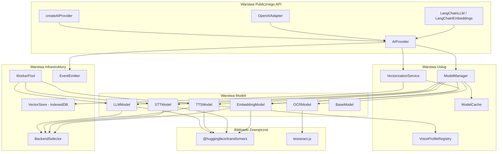
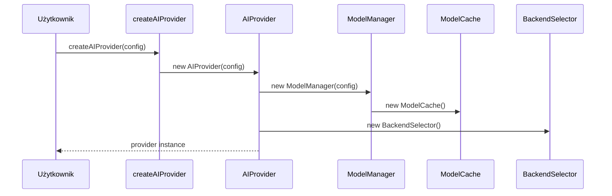
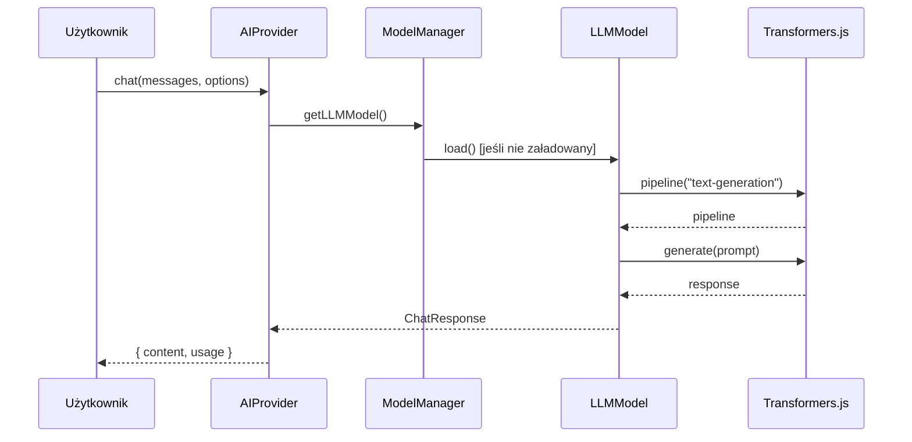
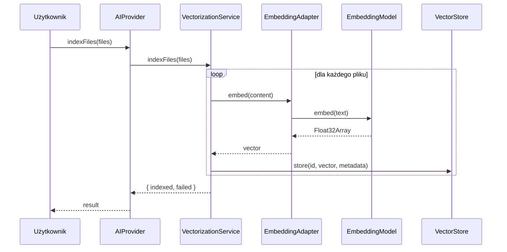
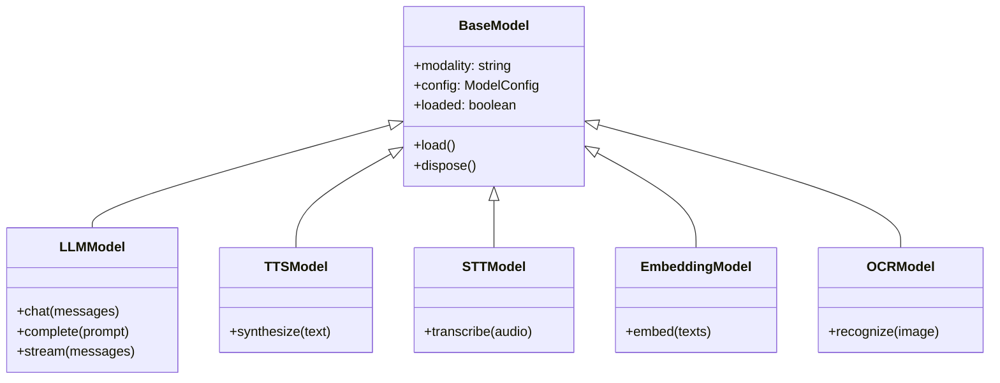
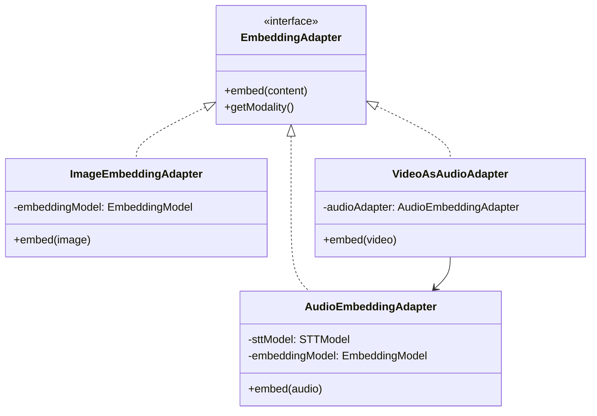
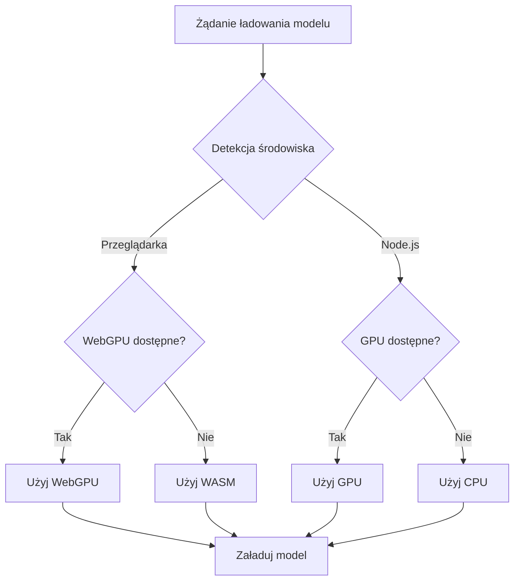
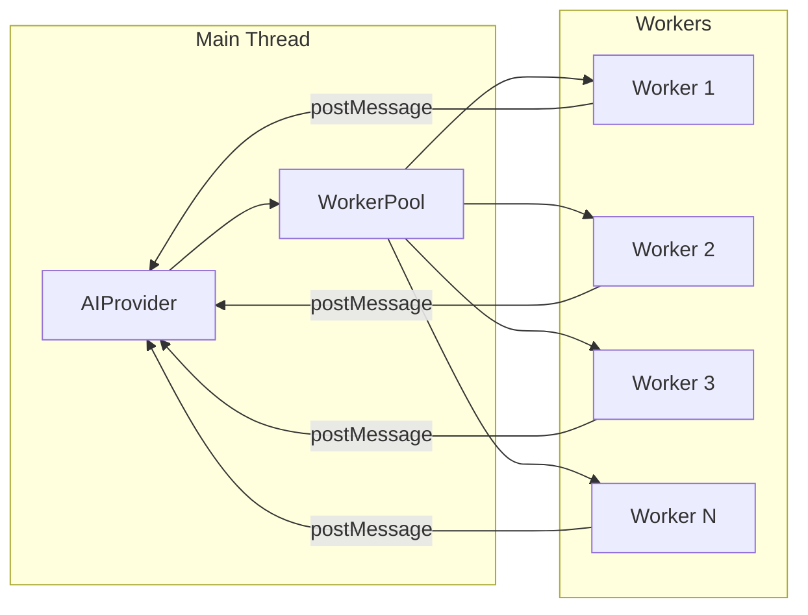

# Architektura LXRT

LXRT to biblioteka TypeScript do uruchamiania modeli AI w jednolitej infrastrukturze. Ten dokument opisuje architekturę systemu, relacje między komponentami i przepływ danych.

---

## Diagram Architektury Głównej



---

## Struktura Katalogów i Relacje

```
src/
├── index.ts                    # Główny punkt eksportu
│
├── adapters/                   # Adaptery kompatybilności
│   ├── OpenAIAdapter.ts        # → używa AIProvider
│   ├── LangChainAdapter.ts     # → używa AIProvider
│   └── index.ts
│
├── app/                        # Logika aplikacji
│   ├── AIProvider.ts           # Fasada główna → ModelManager, VectorizationService
│   ├── ModelManager.ts         # Zarządzanie modelami → Models, ModelCache
│   ├── init.ts                 # Inicjalizacja globalna
│   ├── state.ts                # Stan globalny, rejestr modeli
│   │
│   ├── backend/
│   │   └── BackendSelector.ts  # Wybór WebGPU/WASM → używany przez Models
│   │
│   ├── cache/
│   │   └── ModelCache.ts       # Cache modeli w pamięci
│   │
│   ├── autoscaler/
│   │   └── AutoScaler.ts       # Automatyczne skalowanie zasobów
│   │
│   └── vectorization/
│       ├── VectorizationService.ts  # Główny serwis → VectorStore, Adapters
│       └── adapters/
│           ├── EmbeddingAdapter.ts      # Interfejs bazowy
│           ├── AudioEmbeddingAdapter.ts # Audio → STT → Embedding
│           ├── ImageEmbeddingAdapter.ts # Obrazy
│           └── VideoAsAudioAdapter.ts   # Video → Audio
│
├── core/                       # Typy i encje domenowe
│   ├── types.ts                # Wszystkie typy interfejsów
│   ├── VoiceProfile.ts         # Definicja profilu głosowego
│   └── VoiceProfileRegistry.ts # Rejestr profili → używany przez TTSModel
│
├── domain/                     # Kontrakty i błędy
│   ├── errors/index.ts         # ValidationError, ModelLoadError, etc.
│   ├── models/index.ts         # Interfejsy ILLMModel, ITTSModel, etc.
│   ├── config/Config.ts        # Konfiguracja runtime
│   └── logging/Logger.ts       # Interfejs loggera
│
├── infra/                      # Infrastruktura techniczna
│   ├── events/EventEmitter.ts  # System zdarzeń → używany przez AIProvider
│   ├── logging/defaultLogger.ts
│   │
│   ├── resource/
│   │   ├── ResourceUsageEstimator.ts    # Interfejs
│   │   └── LocalResourceUsageEstimator.ts
│   │
│   ├── vectorstore/
│   │   ├── VectorStore.ts              # Interfejs
│   │   └── LocalVectorStoreIndexedDB.ts # Implementacja IndexedDB
│   │
│   └── workers/
│       ├── WorkerPool.ts       # Pula Web Workers
│       ├── AIProviderWorker.ts # Worker dla AI
│       └── llm.worker.ts       # Skrypt workera
│
├── models/                     # Implementacje modeli AI
│   ├── BaseModel.ts            # Klasa bazowa
│   ├── LLMModel.ts             # → Transformers.js, BackendSelector
│   ├── TTSModel.ts             # → Transformers.js, VoiceProfileRegistry
│   ├── STTModel.ts             # → Transformers.js (Whisper)
│   ├── EmbeddingModel.ts       # → Transformers.js
│   └── OCRModel.ts             # → Tesseract.js
│
├── ui/                         # Bindingi UI
│   ├── react/
│   │   ├── useAIProvider.ts    # Hook React → AIProvider
│   │   ├── useChat.ts          # Hook chatu
│   │   └── useVectorization.ts # Hook wektoryzacji
│   │
│   └── vue/
│       ├── useAIProvider.ts    # Composable Vue
│       ├── useChat.ts
│       └── useVectorization.ts
│
└── utils/                      # Narzędzia pomocnicze
    ├── AudioConverter.ts       # Konwersja audio
    └── ProgressTracker.ts      # Śledzenie postępu
```

---

## Przepływ Danych

### 1. Inicjalizacja AIProvider



### 2. Wywołanie chat()



### 3. Wektoryzacja dla RAG



---

## Kluczowe Relacje Między Komponentami

### AIProvider → Modele

| Metoda AIProvider | Model | Metoda Modelu |
|-------------------|-------|---------------|
| `chat()` | LLMModel | `chat()` |
| `complete()` | LLMModel | `complete()` |
| `stream()` | LLMModel | `stream()` |
| `speak()` | TTSModel | `synthesize()` |
| `listen()` | STTModel | `transcribe()` |
| `recognize()` | OCRModel | `recognize()` |
| `embed()` | EmbeddingModel | `embed()` |

### Dziedziczenie Modeli



### VectorizationService → Adaptery



---

## Wybór Backendu



---

## System Zdarzeń

AIProvider emituje następujące zdarzenia:

| Zdarzenie | Payload | Kiedy |
|-----------|---------|-------|
| `progress` | `{ modality, file, progress, loaded, total }` | Podczas ładowania modelu |
| `ready` | `{ modality }` | Po załadowaniu modelu |
| `error` | `{ modality, error }` | Przy błędzie |

```typescript
provider.on('progress', ({ modality, file, progress }) => {
  console.log(`${modality}: ${file} (${progress}%)`);
});

provider.on('ready', ({ modality }) => {
  console.log(`${modality} gotowy!`);
});
```

---

## Web Workers

WorkerPool zarządza pulą workerów dla ciężkich operacji:



**Rozmiar puli**: `min(8, navigator.hardwareConcurrency || 4)`

---

## IndexedDB Vector Store

VectorStore przechowuje embeddingi lokalnie w IndexedDB:

| Store | Klucz | Wartość |
|-------|-------|---------|
| `vectors` | `id` | `{ vector: Float32Array, metadata: VectorDocMeta }` |

**Operacje:**
- `store(id, vector, metadata)` - zapis wektora
- `search(queryVector, topK)` - wyszukiwanie najbliższych wektorów
- `delete(ids)` - usuwanie wektorów

---

## Powiązane Pliki

- `src/index.ts` - Główny punkt eksportu
- `src/app/AIProvider.ts` - Fasada główna
- `src/app/ModelManager.ts` - Zarządzanie modelami
- `src/app/vectorization/VectorizationService.ts` - Wektoryzacja
- `src/app/backend/BackendSelector.ts` - Wybór backendu
- `src/infra/workers/WorkerPool.ts` - Pula workerów
